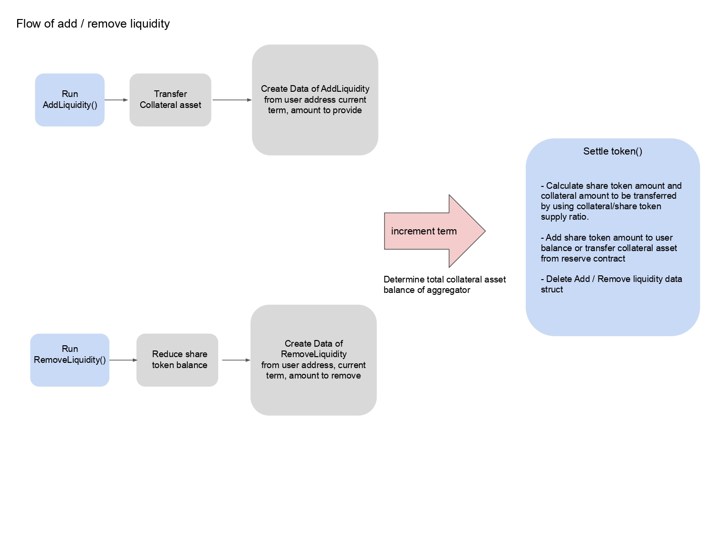
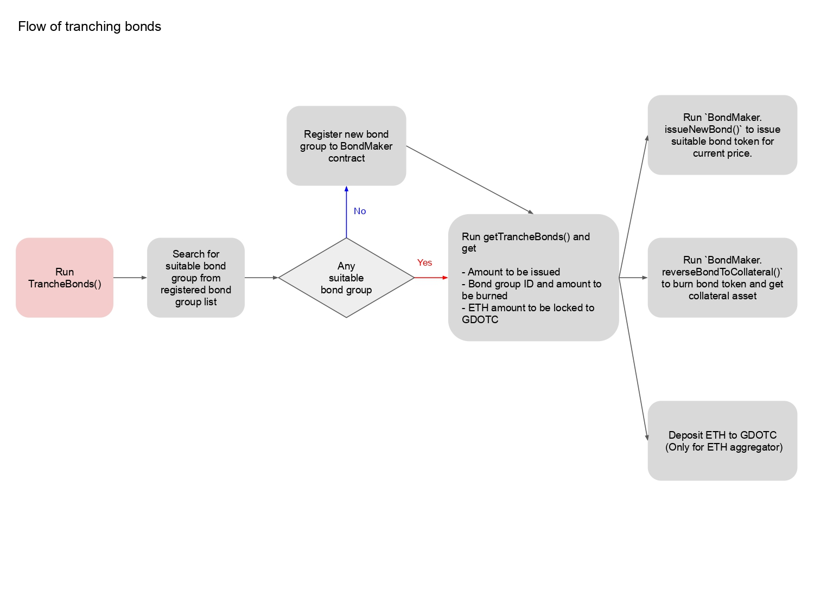
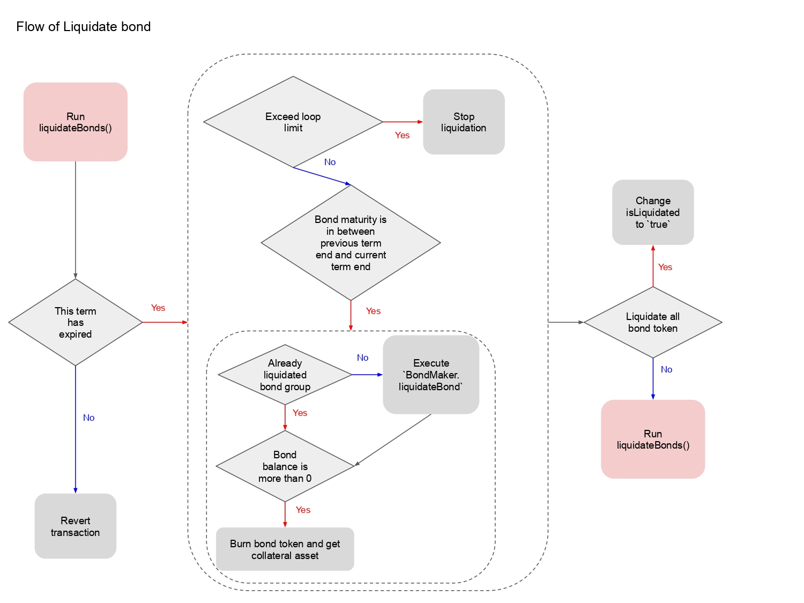
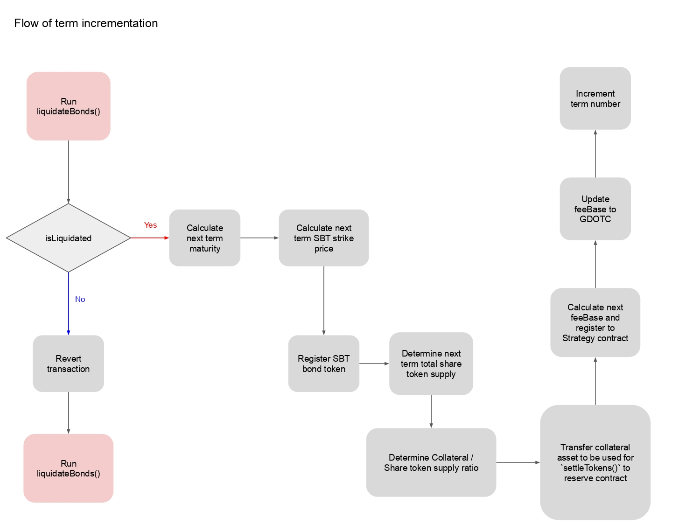

# Meaning of terms
1. Priceunit => A unit of the collateral asset price. The strategy contract determines a SBT strike price, valid shape of bond token and amount of bond to tranche using this value. When collateral asset is ETH/USDC, priceunit is $10.
2. AggregatorLength => The term length of the aggregator.
3. IsReversedOracle => Whether the aggregator uses inverse numbers of an oracle price as the strike price of the bond token.

# Workflow of Lien Aggregator
- Blue figures are functions which users call.
- Red figures are functions which contract manager calls.
- Gray figures are internal transactions.
- Figures with dashed line are internal functions which can be called more than once in one transaction.





# Aggregator
- Used to receive collateral assets and to issue share tokens (share tokens are ERC20)
- It issues bond tokens and provide liquidity for the GDOTC contract (GDOTC means the generalized decentralized exchange of bonds)
- It is the Liquidity mining program of Lien token
## addLiquidity()
- Used to send collateral assets to provide liquidity.
- Although it could be run whenever users want, the collateral assets provided by users are not used in the term the assets are added. The amount of share tokens are not determined at this point as the amount of collateral token is confirmed at the end of the term by Aggregator. 

## removeLiquidity()
- Used to withdraw a certain amount of liquidity and burn share tokens.
- Although it could be run whenever users want, the collateral assets which have been provided are not returned at this point as the collateral token amount of Aggregator in this term is unconfirmed until this term ends.
- The Share Tokens are burned at this point.

## TrancheBonds()
- Used to obtain the amount of issuing/burning bonds from the strategy contract to burn/issue.
- If there is no suitable bond group for the price when TrancheBonds() is called, it registers a new bond group by ```_addSuitableBondGroup()```
- 0th of array ```reverseBonds``` from the strategy contract is bond group ID to be burned and 1st is amount to be burned.
- The value of ```ethAmount``` from the strategy contract is the amount of collateral to be locked to the DOTC contract.
- If the amount to be burned is more than 0, run ```reverseBondToCollateral``` to burn bonds and get collateral assets.
- If the amount to be issued is more than 0, run ```issueNewBonds``` to mint new bonds.

## liquidateBonds()
- Used to burn all bond tokens which Aggregator holds.
- It selects all bond tokens held by Aggreagator whose maturity reaches during this period and burns.
- Run after maturity of this period.
- If there are many bondgroups to be processed, it stops processing to avoid being out of gas.
- It executes liquidation of bond groups.

## renewMaturity()
- Used to update the maturity and the strike price, then settle the share token supply.
- It determines the total supply of share tokens in the next period from the liquidity added and removed during this period.
- It determines the amount of collateral asset which  can be used for issuing bond tokens.
- Collateral assets which are used in ```settleTokens``` are moved to another contract (ReserveETH or ReserveERC20).
- It determines the collateral asset amount per 1 share token, and this amount is used in ```settleTokens()```
- It registers a new feeBase to the strategy contract and then updates the feeBase to GDOTC.

## SettleTokens()
- Used to settle collateral tokens and share tokens added or removed by ```addLiquidity()``` or ```removeLiquidity()```.
- When it runs ```addLiquidity()``` in the previous period, the share token balance is added. When it runs ```removeLiquidity()```, it transfers collateral assets.
- This function is called automatically when ```addLiquidity()``` or ```removeLiquidity()``` is called.

## addSuitableBondGroup
- Used to register a new bond group whose call option strike price is near the price when addSuitableBondGroup is called.
## updateTotalReward()
- Used to determine total reward token (Lien token) amount per 1 term.
- The contract owner can call this function.
## ClaimReward()
- Used to update the reward token amount of ```msg.sender``` and transfer reward tokens when the reward amount is more than 0.
- it changes the reward token amount of ```msg.sender``` to 0.
## _updateReward()
- Used to execute ```ClaimReward()``` every time before changing  the user's share token balance.
- The amount of reward is determined by the period between the next term when _updateReward() has been called last time and the term which is defined in the param ```term```.
- The reward amount per term is calculated by ```balance of share tokens / the total supply in this term * the total reward amount of this term```

# Strategy
- Used to determine the amount of bond tokens to be issued in ```TrancheBond()```.
- It manages feeBase (minimum fee rate in GDOTC) for each aggregator type.
## calcMaturity
- Used to return unix time on Friday 3 weeks later 3 p.m UTC.
- Calculation is  ```Truncate(current timestamp - 144000(the number of seconds from Thursday 0 a.m to Friday 3 p.m) / 604800(the number of seconds of 1 week))  * 604800 + 144000```
## getCurrentStrikePrice()
- Used to determine the valid strike price for the next term.
- It is determined  as the SBT price whose strike price is half of the price when getCurrentStrikePrice is called.
- If the reverse oracle is set to Aggregator, return the reversed value.
## getCurrentSpread()
- Used to return the current feeBase in GDOTC, registered by Aggregator.
## registerAggregators()
- Used to register aggregator addresses and Information about the feeBase calculation by the aggregator owner.
- The Aggregator ID is generated by ```(owner address, oracle address, whether aggregator uses reversed oracle)```
- The feebase is managed by Aggregator ID.
## getTrancheBonds()
- Used to obtain the issuable bond group ID and the list of burnable bond groups from Aggregator, and determines the bond group ID to be burned and the bond token amount to be issued/burned.
- The amount of supply is calculated by ```Usable collateral asset amount / 5 - balance of this bond group```.
- There are three conditions for bond groups to be burned;
A certain bond group holds the call option which strike price is differed from the price when getTrancheBonds() is called more than 5 times of a PriceUnit
The amount of collateral asset held by a certain bond group is more than 10% of the total collateral assets held by Aggregator(=```Usable collateral asset amount / 10```)
The amount of the collateral assets is the largest among the bond group which fulfils the condition 1 and 2
  All of bond groups which fulfils the condition 1 and 2 are burned.

## _updateFeeBase
- When ```collateralPerToken (collateral amount / share tokensupply)``` is decreased by 5%, it increases the feeBase in GDOTC by ```FeeInfo.upwardDifference```
- When ```collateralPerToken (collateral amount / share tokensupply)``` is increase by 5%, it decreases feeBase in GDOTC by ```FeeInfo.downwardDifference``` (But if old feeBase is lesser than ```INITIAL_FEE_BASE```, the new fee base is still ```INITIAL_FEE_BASE```)
- Then it registers the new feeBase to the strategy contract.

# Flow of Aggregator
1. Before the term starts
   - It runs ```renewMaturity()``` and update the strike price and the maturity for this term
2. During the  term
   - It runs ```TrancheBonds()``` to provide the liquidity to GDOTC
3. After the maturity date
   - It burns all bond tokens which is held by Aggregator
4. After liquidation
   - It runs ```renewMaturity()``` and updates the strike price and the maturity for the new period

# Usage
- Initialize (install libraries, download and process submodule repository)
```yarn initialize```
or
```yarn```
- Compile
```yarn compile```
- Migrate to local testnet
```yarn migrate:test:local```
- Unit test
```yarn test:unit```
- Combine test between aggregator and strategy, bond token contracts
```yarn test:combine```

# Target contracts
- contracts/SimpleAggregator/ReserveERC20.sol
- contracts/SimpleAggregator/ReserveETH.sol
- contracts/SimpleAggregator/BondPricerWithAcceptableMaturity.sol
- contracts/SimpleAggregator/BondRegistrator.sol
- contracts/SimpleAggregator/SimpleAggregator.sol
- contracts/SimpleAggregator/SimpleAggregatorCollateralizedERC20.sol
- contracts/SimpleAggregator/SimpleAggregatorCollateralizedEth.sol
- contracts/Strategy/StrategyForSimpleAggregator.sol
- contracts/Strategy/StrategyForSimpleAggregatorETH.sol

## About Corrections from the first audit report
The corrected points are marked with ```AUDIT-FIX``` comment.
### Unchanged Points
- BRR-03: These points are checked in bondmaker contract.
- SAR-02: In our local environment, import path starting with `@openzeppelin` does not work.
- SAR-03: `STRATEGY` and `DOTC` are used in the constructor
- SAR-28: The modification requires a lot of efforts comparing to the benefit from gas optimization
- SAR-29: Same reason as SAR-28
- SFS-01: Same reason as SAR-02
- SFS-04: Same reason as SAR-28
- SFS-08: Current fee base is under 1000
